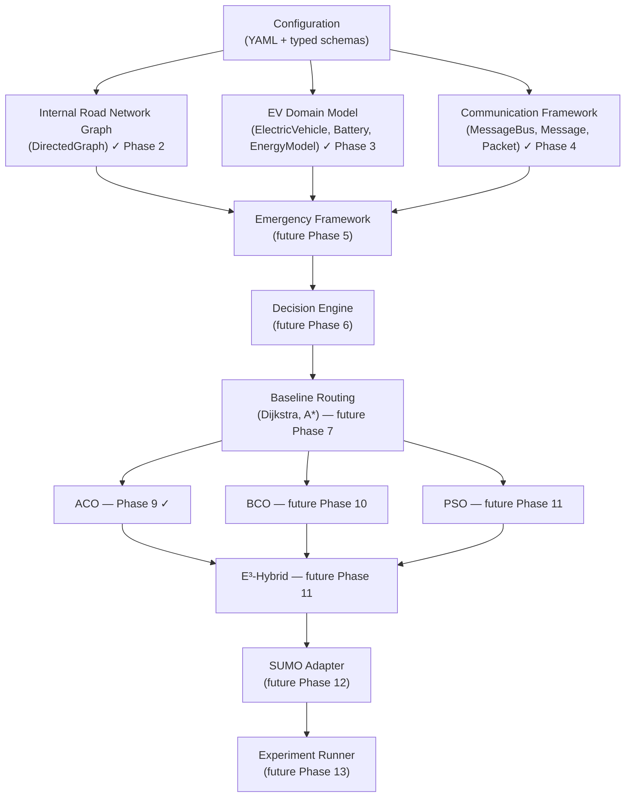
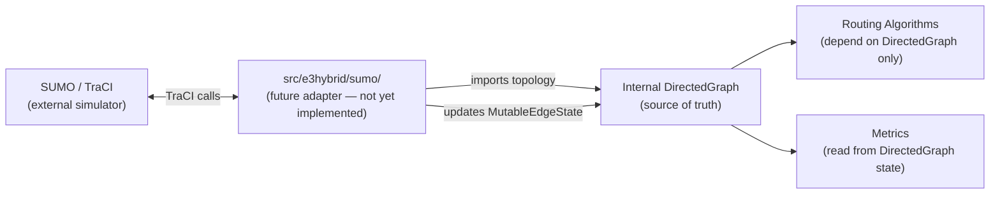
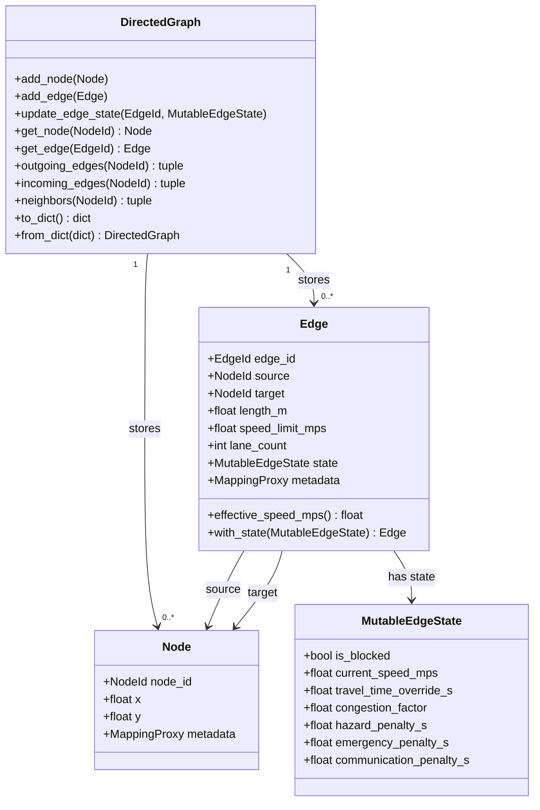
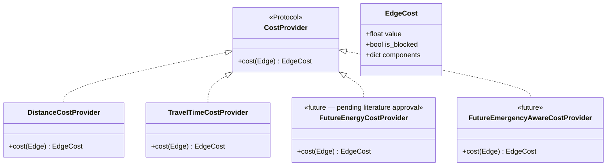
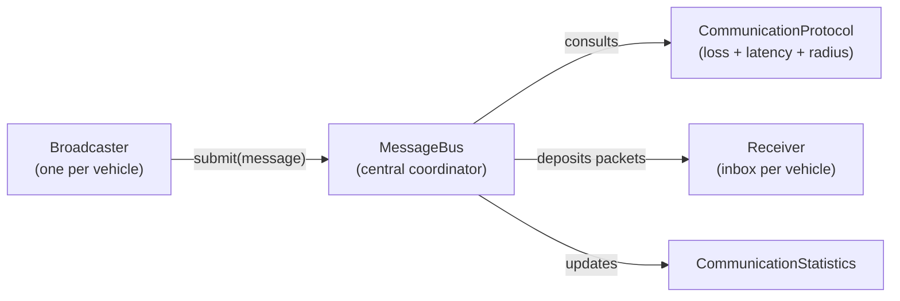

# Architecture

This document records the approved high-level architecture for the E3-Hybrid
research framework. It is updated after every phase review.

---

## 1. Layered Architecture



Every layer depends only on its direct predecessors. Routing algorithms, swarm
primitives, metrics, communication, and decision logic are all kept independent
from SUMO and TraCI. SUMO-specific imports belong only inside the future
`src/e3hybrid/sumo/` adapter package.

The development order above reflects the approved thesis roadmap: communication
and emergency infrastructure must exist before swarm algorithms because the
swarm agents rely on them for decentralized coordination.

---

## 2. SUMO Adapter Boundary

The internal `DirectedGraph` is the canonical road-network model. SUMO is
treated as an external data source that populates the graph — it is never the
source of truth for routing decisions.



Invariant: no file outside `src/e3hybrid/sumo/` may import `traci` or any
other SUMO-specific module.

---

## 3. Internal Graph Model

### 3.1 Node model

```
Node (frozen dataclass)
├── node_id   : NodeId (NewType str)   – unique within the graph
├── x         : float | None           – longitude or projected x-coordinate
├── y         : float | None           – latitude  or projected y-coordinate
└── metadata  : MappingProxyType       – immutable read-only annotations
```

Coordinates are optional so that topology-only graphs (imported from SUMO
net-files that strip coordinates) can still be constructed. When coordinates
are absent, heuristic distance-based algorithms must either skip the node or
use a safe fallback. This assumption is recorded in `assumptions.md`.

### 3.2 Edge model — immutable structural fields

```
Edge (frozen dataclass)
├── edge_id        : EdgeId (NewType str)   – unique within the graph
├── source         : NodeId                 – origin junction
├── target         : NodeId                 – destination junction
├── length_m       : float                  – physical length (> 0)
├── speed_limit_mps: float                  – legal speed limit (> 0)
├── lane_count     : int                    – number of lanes (≥ 1)
├── state          : MutableEdgeState       – simulation-time mutable state
└── metadata       : MappingProxyType       – immutable annotations
```

Structural fields (`edge_id` through `lane_count` and `metadata`) are set at
construction and never changed. Only `state` can be replaced, and only via
`DirectedGraph.update_edge_state(edge_id, new_state)` or the functional copy
`edge.with_state(new_state)`. This enforces the invariant that road topology
cannot be silently overwritten by simulation updates.

`geometry` is reserved for a future phase when polyline coordinates are needed
for map rendering and SUMO import.

### 3.3 Mutable edge state — simulation-time fields

```
MutableEdgeState (frozen dataclass — replaced, never mutated)
├── is_blocked              : bool           – physically impassable
├── current_speed_mps       : float | None   – observed flow speed; None → use speed_limit
├── travel_time_override_s  : float | None   – direct override; None → compute from length/speed
├── congestion_factor       : float (> 0)    – traffic slow-down multiplier; 1.0 = free flow
├── hazard_penalty_s        : float (≥ 0)    – additive penalty for road hazard events
├── emergency_penalty_s     : float (≥ 0)    – additive penalty for emergency corridor restrictions
├── communication_penalty_s : float (≥ 0)    – additive penalty for communication-disrupted zones
└── metadata                : MappingProxyType
```

`MutableEdgeState` is itself frozen. The "mutable" qualifier refers to the
fact that the `state` slot on `Edge` is replaced during simulation ticks —
not that the object itself changes. This ensures all state transitions are
explicit and auditable.

`EdgeDynamicAttributes` is retained as a public backward-compatible alias for
`MutableEdgeState`. New code should use `MutableEdgeState`.

### 3.4 Graph invariants

The following invariants are enforced at insertion time and re-checked by
`GraphValidator`:

1. **Unique node IDs** — `add_node` raises `NetworkError` immediately on
   duplicate `node_id`.
2. **Unique edge IDs** — `add_edge` raises `NetworkError` immediately on
   duplicate `edge_id`.
3. **Referential integrity** — `add_edge` raises `NetworkError` if `source` or
   `target` are not already in `_nodes`.
4. **Positive length** — `Edge.__post_init__` rejects `length_m ≤ 0`.
5. **Positive speed limit** — `Edge.__post_init__` rejects `speed_limit_mps ≤ 0`.
6. **Positive lane count** — `Edge.__post_init__` rejects `lane_count ≤ 0`.
7. **No self-loops by default** — `GraphValidator` rejects edges where
   `source == target` unless `allow_self_loops=True` is passed.
8. **No duplicate adjacency entries** — `GraphValidator` checks that no
   `EdgeId` appears more than once in a node's outgoing list.

Soft warnings (non-blocking, logged by `GraphValidator.validate_or_raise`):

- **Isolated nodes** — a node with no incoming and no outgoing edges. Valid in
  rare scenarios but almost always a data import error.

### 3.5 Adjacency structure

```
_nodes    : dict[NodeId, Node]         – O(1) node lookup
_edges    : dict[EdgeId, Edge]         – O(1) edge lookup
_outgoing : dict[NodeId, list[EdgeId]] – forward adjacency (source → edges)
_incoming : dict[NodeId, list[EdgeId]] – reverse adjacency (target → edges)
```

All four dictionaries are insertion-ordered (CPython 3.7+ guarantee). This
means graph traversal is deterministic across runs when the graph is built
from a consistently ordered source, which is required for reproducible
experiment results.

```
Adjacency diagram for a 3-node graph (A → B, B → C, A → C):

  _nodes           _edges
  ┌───┬──────┐     ┌────┬──────────┐
  │ A │ Node │     │ AB │ Edge(AB) │
  │ B │ Node │     │ BC │ Edge(BC) │
  │ C │ Node │     │ AC │ Edge(AC) │
  └───┴──────┘     └────┴──────────┘

  _outgoing                _incoming
  ┌───┬──────────┐         ┌───┬──────────┐
  │ A │ [AB, AC] │         │ A │ []       │
  │ B │ [BC]     │         │ B │ [AB]     │
  │ C │ []       │         │ C │ [BC, AC] │
  └───┴──────────┘         └───┴──────────┘
```

### 3.6 Node–edge relationship



---

## 4. Cost Provider Interface

Routing algorithms must never inspect edge internals directly. They receive a
`CostProvider` by injection and call `provider.cost(edge) → EdgeCost`.



`TravelTimeCostProvider` computes:

```
base_time        = travel_time_override_s  if set
                   else  length_m / effective_speed_mps
congested_time   = base_time × congestion_factor
total_cost       = congested_time
                   + hazard_penalty_s
                   + emergency_penalty_s
                   + communication_penalty_s
```

All five components are recorded in `EdgeCost.components` for diagnostics.

---

## 5. Communication Framework

The communication layer is a **simulator-independent message-passing infrastructure**
that transports structured messages between simulation agents. It knows nothing
about routing, swarm logic, SUMO, or vehicle physics.



### Message lifecycle

```
Message.create() → bus.submit() → bus.tick(t) → [expired? → EXPIRED]
                                               → [loss?    → DROPPED]
                                               → [range?   → OUT_OF_RANGE]
                                               → latency   → DELIVERED → Receiver.inbox
```

### Protocol interfaces (all Protocols — pluggable)

| Interface | Purpose | Phase 4 baseline | Future |
|---|---|---|---|
| `PacketLossModel` | Drop decision | `NoLossModel` | `DistanceLossModel`, DSRC BER curves |
| `LatencyModel` | Delay computation | `ZeroLatencyModel` | `ConstantLatencyModel`, DSRC distributions |
| `CommunicationRadiusModel` | Range check | `InfiniteRadiusModel` | `FixedRadiusModel`, SUMO-integrated |
| `CommunicationProtocol` | Bundles all three | `DeterministicProtocol` | `DSRCProtocol`, `CV2XProtocol` |

Full class diagram and lifecycle documentation: `docs/communication_architecture.md`.

---

## 6. Serialization

Every serialized `DirectedGraph` is wrapped in a versioned envelope:

```json
{
  "schema_version": 1,
  "created_at": "2026-07-08T14:35:21.000000+00:00",
  "metadata": { "source": "osm_import", "city": "testville" },
  "validation_status": "valid",
  "nodes": [ ... ],
  "edges": [ ... ]
}
```

| Field               | Purpose                                                   |
|---------------------|-----------------------------------------------------------|
| `schema_version`    | Integer; allows forward-compatible deserialization checks |
| `created_at`        | ISO-8601 UTC timestamp of when `to_dict()` was called     |
| `metadata`          | Arbitrary graph-level annotations (source, region, …)     |
| `validation_status` | `"unvalidated"`, `"valid"`, or `"invalid"`               |

`from_dict()` rejects any `schema_version` greater than
`CURRENT_SCHEMA_VERSION` (currently 1) and accepts legacy graphs that lack the
field (treated as version 0).

Edge serialization uses the key `"state"` (new). Graphs serialized with the
old `"dynamic"` key are still accepted by `Edge.from_dict` for backward
compatibility.

---

## 7. Performance — Time and Space Complexity

Let V = number of nodes, E = number of edges, deg(v) = degree of node v.

### Time complexity

| Operation                        | Complexity           | Notes                                    |
|----------------------------------|----------------------|------------------------------------------|
| `add_node`                       | O(1) amortised       | Dict insert + two `setdefault` calls     |
| `add_edge`                       | O(1) amortised       | Dict insert + two `list.append` calls    |
| `has_node`                       | O(1)                 | Dict key lookup                          |
| `has_edge`                       | O(1)                 | Dict key lookup                          |
| `get_node`                       | O(1)                 | Dict key lookup                          |
| `get_edge`                       | O(1)                 | Dict key lookup                          |
| `nodes()`                        | O(V)                 | Tuple construction from dict values      |
| `edges()`                        | O(E)                 | Tuple construction from dict values      |
| `outgoing_edges(v)`              | O(deg_out(v))        | Tuple over adjacency list                |
| `incoming_edges(v)`              | O(deg_in(v))         | Tuple over reverse adjacency list        |
| `neighbors(v)`                   | O(deg_out(v))        | Derives from `outgoing_edges`            |
| `update_edge_state`              | O(1)                 | One `get_edge` + one dict assign         |
| `to_dict()`                      | O(V + E)             | Serialises every node and edge           |
| `from_dict()`                    | O(V + E)             | Deserialises every node and edge         |
| `GraphValidator.validate`        | O(V + E)             | Single pass over nodes and edges         |
| `remove_node` (not yet impl.)    | O(deg(v) + V + E)    | Must remove incident edges and rebuild   |
| `remove_edge` (not yet impl.)    | O(deg(v))            | Scan adjacency list to remove entry      |

Note: `remove_node` and `remove_edge` are not implemented in Phase 2. When
they are added (likely Phase 4 for scenario mutation), the adjacency list scan
makes `remove_edge` O(deg(v)); using a set instead of a list would make it
O(1) but would break insertion-order determinism. The list-based design is the
correct trade-off for this research use case.

### Space complexity

| Structure          | Space    | Notes                                           |
|--------------------|----------|-------------------------------------------------|
| `_nodes`           | O(V)     | One entry per node                              |
| `_edges`           | O(E)     | One entry per edge                              |
| `_outgoing`        | O(V + E) | One list per node, total entries = E            |
| `_incoming`        | O(V + E) | One list per node, total entries = E            |
| Total graph        | O(V + E) | Standard adjacency-list representation          |
| Serialized form    | O(V + E) | Proportional to graph size                      |

### Why adjacency lists over an adjacency matrix

An adjacency matrix would provide O(1) edge-existence checks (by index lookup)
but would cost O(V²) space. Real road networks are sparse — a typical junction
has 2–6 outgoing edges. For a 10,000-node city network the matrix would
require 10,000² = 100 million entries, most of which are empty. The list
representation keeps memory proportional to actual road density and is the
standard choice for sparse graph algorithms including Dijkstra and A*.

---

## 8. Phase Status and Approved Roadmap

| Phase | Description                                           | Status              |
|-------|-------------------------------------------------------|---------------------|
| 1     | Infrastructure skeleton                               | Complete (approved) |
| 2     | Simulator-agnostic road network core                  | Complete (approved) |
| 3     | EV domain model (vehicle, battery, energy model stub) | Complete (approved) |
| 4     | Communication framework                               | Complete (approved) |
| 5     | Emergency framework                                   | Complete (approved) |
| 6     | Decision engine                                       | Complete (approved) |
| 7A    | Routing architecture design                           | Complete (approved) |
| 7B    | Baseline routing (Dijkstra)                           | Complete (approved) |
| 7C    | Benchmark and verification framework                  | Complete (approved) |
| 7D    | Baseline routing (A*)                                 | Complete (approved) |
| 8A    | Swarm architecture design                             | Complete (approved) |
| 8B    | Swarm infrastructure implementation                   | Complete (approved) |
| 9A    | ACO algorithm design                                  | Complete (approved) |
| 9B    | ACO implementation (ACS)                              | Complete (approved) |
| 10    | BCO                                                   | Not started         |
| 11    | PSO                                                   | Not started         |
| 12    | E³-Hybrid                                             | Not started         |
| 13    | SUMO adapter                                          | Not started         |
| 14    | Experiment runner and metrics                         | Not started         |

**Why this order?**  
Communication and emergency handling are placed before the swarm algorithms
because ACO, BCO, PSO, and E³-Hybrid all depend on message passing to
coordinate decentralized decisions. Building the transport layer first ensures
the swarm algorithms have a stable, tested foundation to build on.

The energy model concrete equations (Fiori et al., 2016) are deferred until after
baseline routing is in place. The model is a supporting subsystem; the primary
contribution of the thesis is decentralized swarm routing.
