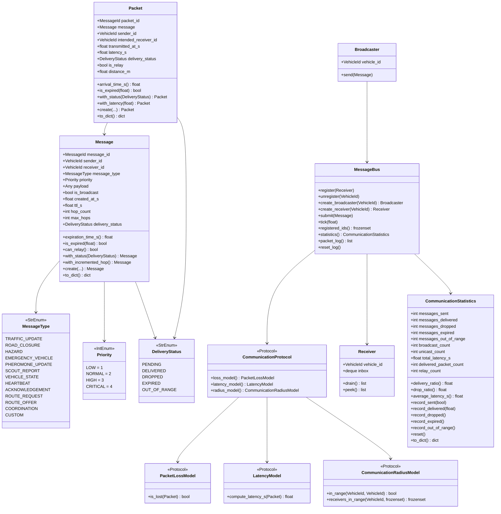

# Communication Architecture

**Phase:** 4 (complete)  
**Status:** Infrastructure implemented. No routing, swarm, emergency, or SUMO logic.  
**Approval required before:** Realistic channel models (IEEE 802.11p, C-V2X), V2X infrastructure, or SUMO integration.

---

## 1. Purpose and Scope

The communication module provides a **simulator-independent message-passing infrastructure** for the E3-Hybrid framework. It transports structured messages between simulation agents (vehicles, emergency coordinator, future infrastructure nodes) without knowing anything about:

- routing algorithms (ACO, BCO, PSO, Dijkstra)
- vehicle physics or energy consumption
- emergency corridor logic
- SUMO or TraCI

This separation is intentional. The communication layer is a pure transport mechanism. Routing algorithms, swarm agents, and the emergency framework read and write messages; the communication layer delivers them.

---

## 2. Module Structure

```
src/e3hybrid/communication/
├── __init__.py          Public API
├── types.py             MessageId, DeliveryStatus enum
├── enums.py             MessageType enum, Priority enum
├── message.py           Message dataclass (immutable)
├── packet.py            Packet dataclass (one delivery attempt)
├── protocols.py         CommunicationProtocol, PacketLossModel,
│                        LatencyModel, CommunicationRadiusModel (Protocols)
├── models.py            Baseline implementations: NoLossModel,
│                        ZeroLatencyModel, ConstantLatencyModel,
│                        InfiniteRadiusModel, FixedRadiusModel,
│                        DeterministicProtocol
├── bus.py               MessageBus, Broadcaster, Receiver
└── statistics.py        CommunicationStatistics
```

---

## 3. Class Diagram



---

## 4. Message Lifecycle

Every message follows a deterministic state machine from creation to final status:

```
                        ┌─────────────────────────┐
                        │    Message.create()      │
                        │    status = PENDING      │
                        └────────────┬────────────┘
                                     │
                              bus.submit(msg)
                                     │
                              bus.tick(t)
                                     │
               ┌─────────────────────┼──────────────────────┐
               │                     │                       │
         TTL expired?          Unicast: in_range?      is_broadcast?
               │                     │                       │
             YES                      NO                      YES
               │                     │                       │
               ▼                     ▼                  expand targets
          EXPIRED              OUT_OF_RANGE           via radius_model
          (discard)            (discard)                     │
                                               ┌─────────────┘
                                               │ for each target:
                                               │
                                        loss_model.is_lost()?
                                               │
                                    YES ───────┴─────── NO
                                    │                    │
                                 DROPPED         latency_model
                                              compute_latency_s()
                                                         │
                                               Packet delivered
                                               to Receiver.inbox
                                                         │
                                                    DELIVERED
```

**Key invariants:**
- A `Message` object is never mutated. Status transitions create new instances via `with_status()`.
- A `Packet` wraps exactly one `Message`. One broadcast `Message` produces N packets (one per receiver in range).
- The `MessageBus` never inspects `payload` — that is the responsibility of the consuming agent.
- Duplicate `message_id` values are silently ignored after the first delivery (idempotency guard).
- Expired messages are detected at `tick()` time, not at `submit()` time. This allows messages to be queued before the simulation clock advances.

---

## 5. Baseline Protocol Models

All three sub-models satisfy their respective Protocols and are independently replaceable:

| Model | Loss | Latency | Radius | Use case |
|---|---|---|---|---|
| `DeterministicProtocol` | `NoLossModel` | `ZeroLatencyModel` | `InfiniteRadiusModel` | Unit tests, ideal-channel baseline experiment |
| Custom | `NoLossModel` | `ConstantLatencyModel(0.01)` | `FixedRadiusModel(300)` | Simple V2V simulation without SUMO positions |
| Future | `DistanceLossModel` | `DSRCLatencyModel` | `ObstacleRadiusModel` | Realistic DSRC channel (Phase 8) |
| Future | `ProbabilisticLossModel` | `StochasticLatencyModel` | `SUMORadiusModel` | SUMO-integrated channel (Phase 8) |

The `MessageBus` depends only on `CommunicationProtocol`. Swapping the protocol requires no changes to the bus or any consuming code.

---

## 6. Swarm Algorithm Integration (Future Phase 7)

Swarm agents (ACO, BCO, PSO, E³-Hybrid) will use the communication layer through `Broadcaster` and `Receiver`. They never access the bus directly.

```
ACO Agent (Phase 7)
  │
  ├── reads inbox via Receiver.drain()
  │     └── processes PHEROMONE_UPDATE messages from neighbours
  │
  └── sends via Broadcaster.send(Message)
        └── MessageType.PHEROMONE_UPDATE, payload = {edge_id, delta}
              │
              ▼
          MessageBus.submit()
              │
              ▼
          MessageBus.tick(t)
              │
              ▼
          Neighbour Receiver.inbox ← Packet(PHEROMONE_UPDATE)
```

**Design requirement:** ACO, BCO, and PSO agents must never import `MessageBus`, `Packet`, or any concrete model class. They depend only on `Broadcaster` and `Receiver`, which are the correct injection boundaries.

---

## 7. Emergency Framework Integration (Future Phase 5)

The emergency coordinator will broadcast high-priority messages to all vehicles within communication range:

```python
# Pseudocode — Phase 5
emergency_broadcaster.send(
    Message.create(
        sender_id=VehicleId("emergency_coordinator"),
        message_type=MessageType.EMERGENCY_VEHICLE,
        payload={"affected_edges": ["E12", "E13"], "duration_s": 300},
        created_at_s=sim_time,
        ttl_s=60.0,
        priority=Priority.CRITICAL,
        is_broadcast=True,
    )
)
```

Vehicles subscribing to `EMERGENCY_VEHICLE` messages drain their inbox and update their routing cost model (via the `EmergencyPolicy` interface — future Phase 5). The communication layer does not know what the payload means.

---

## 8. V2V and V2X Integration (Future)

### V2V (Vehicle-to-Vehicle)

Phase 4 already supports V2V through the broadcast mechanism. Each vehicle is both a `Broadcaster` (sender) and a `Receiver` (recipient). The `CommunicationRadiusModel` controls which vehicles are within range.

Future enhancements:
- **Multi-hop relay**: Messages with `max_hops > 1` are relayed by intermediate vehicles. The relay logic increments `hop_count` via `Message.with_incremented_hop()`. The bus already tracks relay packets via `is_relay=True`.
- **Priority queuing**: The `MessageBus.tick()` could process `CRITICAL` messages before `LOW` messages when the channel is congested. The `Priority` enum already assigns integer values for ordering.

### V2X (Vehicle-to-Infrastructure)

V2X requires infrastructure node IDs. The `MessageBus` is already node-agnostic — any string `VehicleId` can represent an RSU (Roadside Unit) or traffic management centre. No code changes are needed to support V2X:

```python
# Register infrastructure node
rsu_receiver = bus.create_receiver(VehicleId("rsu_intersection_42"))

# Vehicle sends to infrastructure
broadcaster.send(Message.create(
    sender_id=VehicleId("v1"),
    receiver_id=VehicleId("rsu_intersection_42"),
    message_type=MessageType.VEHICLE_STATE,
    payload={"soc_kwh": 18.5, "current_edge": "E22"},
    ...
))
```

### Cross-Brand Protocol (Future Research)

In a real-world deployment, vehicles from different manufacturers may use different communication standards (DSRC, C-V2X, 5G NR-V2X). The `CommunicationProtocol` interface supports this through separate concrete implementations:

```
DeterministicProtocol  ←  unit tests
DSRCProtocol           ←  IEEE 802.11p simulation (Phase 8)
CV2XProtocol           ←  3GPP C-V2X simulation (future)
HybridProtocol         ←  mixed-standard scenarios (future)
```

All plug into the same `MessageBus` without any code changes.

---

## 9. SUMO Integration (Future Phase 8)

When the SUMO adapter is added, two integration points are needed:

### 9.1 Position injection for FixedRadiusModel

```python
# Phase 8 — called each simulation tick via TraCI
for vehicle_id in traci.vehicle.getIDList():
    x, y = traci.vehicle.getPosition(vehicle_id)
    radius_model.register_position(VehicleId(vehicle_id), x, y)
```

The `FixedRadiusModel.register_position()` method already exists for this purpose.

### 9.2 Message generation from SUMO events

SUMO edge closures, emergencies, and rerouting events will be translated into `Message` objects by the SUMO adapter and submitted to the `MessageBus`. The adapter is the only module that imports `traci`.

```
SUMO Event → sumo/adapter.py → Message → MessageBus.submit()
                                               │
                                        All vehicles in range
                                        receive the update
```

The communication layer itself never imports `traci`.

---

## 10. Communication Statistics Output

At run end, `CommunicationStatistics.to_dict()` populates `communication_log.csv` (see `experiment_protocol.md`):

| Metric | Description |
|---|---|
| `messages_sent` | Total messages submitted to the bus |
| `messages_delivered` | Packets successfully deposited into receiver inboxes |
| `messages_dropped` | Packets discarded by `PacketLossModel` |
| `messages_expired` | Messages discarded due to TTL |
| `messages_out_of_range` | Unicast packets where target was unreachable |
| `broadcast_count` | Number of broadcast messages |
| `unicast_count` | Number of unicast messages |
| `delivery_ratio` | `messages_delivered / messages_sent` |
| `drop_ratio` | `messages_dropped / messages_sent` |
| `average_latency_s` | Mean packet latency across delivered packets |
| `relay_count` | Number of relay-forwarded packets |

These metrics are essential for evaluating how communication quality affects swarm routing performance — a key research variable in the E³-Hybrid evaluation.

---

## 11. Design Invariants

1. The `MessageBus` never inspects message payloads.
2. `Message` and `Packet` objects are immutable. All state transitions produce new instances.
3. The bus advances only when `tick(t)` is called — no background threads.
4. Duplicate `message_id` values are silently rejected after first processing.
5. No concrete channel model is imported by `MessageBus`. It depends only on `CommunicationProtocol` Protocol.
6. `Broadcaster` and `Receiver` are the only injection points for agents. Agents never access `MessageBus` directly.
7. The communication module never imports from `network`, `vehicle`, `routing`, or `sumo` packages. It only imports `VehicleId` from `vehicle.types` as a shared identifier type.
