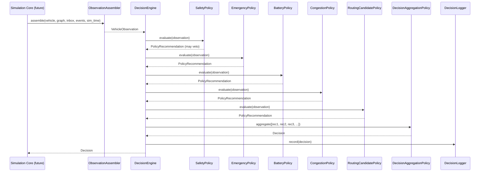

# Decision Engine Design Document

**Document Status:** Phase 6A — awaiting approval before implementation
**Date:** 2026-07-08
**Approval Required Before:** Any Decision Engine code is written

---

## Overview

The Decision Engine is the **core intelligence layer** of the E³-Hybrid framework.
It is not a routing algorithm. It does not compute routes, pheromone trails,
particle positions, or scout paths. It is the coordination layer that evaluates
information arriving from every subsystem and decides what an individual vehicle
should do next.

This separation is the central architectural choice that makes ACO, BCO, PSO, and
E³-Hybrid comparable on equal terms. Every algorithm produces **routing candidates**.
The Decision Engine selects actions from those candidates based on a consistent,
configurable, policy-driven evaluation pipeline. Swapping ACO for PSO means
changing the candidate generator — it does not change the Decision Engine.

---

## 1. Responsibilities

The Decision Engine is responsible for answering one question per evaluation cycle:

> **Given everything this vehicle currently knows, what should it do next?**

Concrete responsibilities:

| Responsibility | Example trigger | Output decision |
|---|---|---|
| Should reroute? | Road closure received | `RequestReroute` |
| Should keep current route? | No new information | `KeepCurrentRoute` |
| Should yield? | `EmergencyVehicleEvent` received | `Yield` |
| Should wait? | Battery near minimum threshold | `Wait` |
| Should reduce speed? | Congestion detected ahead | `ReduceSpeed` |
| Should broadcast? | New hazard observed | `BroadcastMessage` |
| Should request exploration? | Route quality uncertain | `RequestExploration` |
| Should ignore an event? | Event outside operational area | `IgnoreEvent` |
| Should preserve battery? | SoC approaching minimum | `ReduceSpeed` or `Wait` |

**What the Decision Engine must NOT do:**

- Compute routes (that is the routing algorithm's responsibility)
- Modify the `DirectedGraph` directly (that is `NetworkEffectSubscriber`'s job)
- Send messages directly (it produces `BroadcastMessage` decisions; the
  communication layer executes them)
- Know whether routing candidates came from Dijkstra, ACO, BCO, PSO, or any
  other algorithm
- Know about SUMO or TraCI internals
- Make assumptions about battery chemistry or energy model specifics

---

## 2. Inputs — Observation Model

The Decision Engine consumes a structured `VehicleObservation` snapshot assembled
once per evaluation cycle. It never polls subsystems directly.

```
VehicleObservation (frozen dataclass)
│
├── vehicle_id            : VehicleId
├── sim_time_s            : float
│
├── vehicle_state         : VehicleState        (position, speed, accel)
├── battery_state         : BatterySnapshot     (soc_kwh, soc_fraction, capacity_kwh)
├── constraints           : VehicleConstraints  (min/max SoC, max speed)
│
├── current_route         : RouteSnapshot | None  (current edge sequence + estimated cost)
├── routing_candidates    : tuple[RouteCandidate, ...]  (from routing algorithm, may be empty)
│
├── graph_snapshot        : GraphSnapshot       (relevant subgraph state — not full graph)
│
├── inbox_messages        : tuple[Message, ...]  (drained from Receiver.inbox this tick)
├── active_events         : tuple[EmergencyEvent, ...]  (from EmergencyRegistry)
│
├── scenario_time_s       : float               (simulation clock for reproducibility)
└── config                : DecisionConfig      (policy thresholds, flags)
```

### Input source mapping

| Field | Source | Available in Phase 6 |
|---|---|---|
| `vehicle_state` | `ElectricVehicle.state` | Yes |
| `battery_state` | `ElectricVehicle.battery` | Yes |
| `constraints` | `ElectricVehicle.constraints` | Yes |
| `current_route` | Routing algorithm (Phase 7) | As stub |
| `routing_candidates` | Routing algorithm (Phase 7+) | As empty tuple |
| `graph_snapshot` | `DirectedGraph` query | Yes |
| `inbox_messages` | `Receiver.drain()` | Yes |
| `active_events` | `EmergencyRegistry.active_events()` | Yes |
| `scenario_time_s` | Simulation clock | Yes |
| `config` | YAML configuration | Yes |
| SUMO state | TraCI (Phase 12) | No — future |
| Swarm scores | ACO/BCO/PSO (Phase 8+) | No — future, via `routing_candidates` |

Nothing in `VehicleObservation` is mutable. The Decision Engine is a pure
function from observation to decision. The same observation always produces the
same decision given the same policy configuration.

---

## 3. Outputs — Decision Model

The Decision Engine never manipulates any subsystem directly. It produces a
`Decision` object. The simulation core (future Phase 7 integration layer)
reads the decision and orchestrates the required subsystem calls.

```
Decision (frozen dataclass)
│
├── decision_id     : DecisionId        (UUID, for logging)
├── vehicle_id      : VehicleId
├── sim_time_s      : float
├── decision_type   : DecisionType      (enum)
├── trigger         : str               (human-readable cause)
├── observations    : VehicleObservation  (snapshot that produced this decision)
├── applied_policies: tuple[str, ...]   (names of policies that influenced result)
├── confidence      : float | None      (0.0–1.0; None if not meaningful)
├── explanation     : str               (thesis-debuggable human explanation)
└── payload         : Any               (type-specific parameters)
```

### Decision types

```python
class DecisionType(StrEnum):
    KEEP_CURRENT_ROUTE  = "keep_current_route"
    REQUEST_REROUTE     = "request_reroute"
    YIELD               = "yield"
    WAIT                = "wait"
    REDUCE_SPEED        = "reduce_speed"
    BROADCAST_MESSAGE   = "broadcast_message"
    REQUEST_EXPLORATION = "request_exploration"
    IGNORE_EVENT        = "ignore_event"
    EMERGENCY_STOP      = "emergency_stop"
    # Future extensible without changing existing decisions
    CHARGE              = "charge"          # Phase 9
    COORDINATE          = "coordinate"      # Phase 9 (swarm)
```

### Decision payload examples

| DecisionType | Payload fields |
|---|---|
| `REQUEST_REROUTE` | `reason: str`, `avoid_edges: frozenset[EdgeId]` |
| `YIELD` | `emergency_event_id: EventId`, `wait_duration_s: float` |
| `REDUCE_SPEED` | `target_speed_mps: float`, `reason: str` |
| `BROADCAST_MESSAGE` | `message_type: MessageType`, `payload: Any`, `radius_m: float` |
| `WAIT` | `duration_s: float`, `reason: str` |
| `KEEP_CURRENT_ROUTE` | (empty) |
| `IGNORE_EVENT` | `event_id: EventId`, `reason: str` |

### Explainability requirement

Every `Decision` must contain a human-readable `explanation` field suitable for:
- Debug logging during development
- Thesis evaluation ("why did vehicle v12 yield at t=305 s?")
- Post-run audit trail in `decision_log.csv` (experiment output)

Example explanation strings:
```
"Battery SoC (4.2 kWh) is below safety threshold (5.0 kWh). Waiting at node N7."
"EmergencyVehicleEvent ev_003 received. Yielding for 30 s at current position."
"Road closure detected on AB. Requesting reroute avoiding [AB, BC]."
"No new information. Keeping current route (confidence: 0.91)."
```

---

## 4. Policy Architecture

All decision logic is implemented as **Policy interfaces**, not inside the
Decision Engine class itself. This is the same Protocol-based pattern used
throughout the framework (`CostProvider`, `EnergyModel`, `CommunicationProtocol`).

### Policy Protocol

```python
class DecisionPolicy(Protocol):
    """Interface satisfied by every decision policy."""

    @property
    def name(self) -> str: ...

    def evaluate(
        self, observation: VehicleObservation
    ) -> PolicyRecommendation: ...
```

### PolicyRecommendation

```python
@dataclass(frozen=True)
class PolicyRecommendation:
    """A single policy's recommendation for what the vehicle should do."""
    decision_type  : DecisionType
    priority       : int           # higher = more urgent
    confidence     : float         # [0.0, 1.0]
    explanation    : str
    payload        : Any = None
    veto           : bool = False  # True = hard constraint, cannot be overridden
```

When `veto=True`, the recommendation is a **hard constraint**. The aggregation
policy must honour it regardless of what other policies recommend.

### Policy inventory

| Policy | Evaluates | Hard constraint? | Phase |
|---|---|---|---|
| `SafetyPolicy` | blocked road, invalid route, collision risk | Yes | 6 |
| `EmergencyPolicy` | active `EmergencyVehicleEvent`, yield logic | Yes (yield) | 6 |
| `BatteryPolicy` | SoC vs. min threshold, range anxiety | Yes (emergency stop) | 6 |
| `CongestionPolicy` | congestion_factor, road block events | No | 6 |
| `CommunicationPolicy` | blackout zones, stale message age | No | 6 |
| `RoutingCandidatePolicy` | score routing candidates | No | 7 (stub in 6) |
| `SwarmCoordinationPolicy` | pheromone/scout signals | No | 8+ |
| `DecisionAggregationPolicy` | resolves conflicts between policies | Yes (priority) | 6 |

All policies are pluggable. Adding a new policy requires:
1. A new class satisfying `DecisionPolicy` Protocol.
2. Registration in `DecisionEngine.__init__` config.
3. No changes to existing policies.

---

## 5. Decision Priority Ordering

When two or more policies produce conflicting recommendations, the
`DecisionAggregationPolicy` resolves the conflict using this priority order:

```
Priority 1 (Highest) — SAFETY
    Blocked road, depleted battery, invalid route.
    Rationale: a vehicle that continues on a blocked road or with zero battery
    creates simulation state corruption. These must never be overridden.

Priority 2 — EMERGENCY
    Active EmergencyVehicleEvent requiring yield.
    Rationale: emergency vehicle corridors are a hard thesis research variable.
    Algorithms that fail to yield skew corridor-formation-time metrics.

Priority 3 — BATTERY
    SoC approaching minimum operational threshold.
    Rationale: driving a vehicle below min_soc produces invalid simulation state.
    This is softer than safety (the vehicle may still finish the current edge)
    but must override routing efficiency decisions.

Priority 4 — TRAFFIC / CONGESTION
    Active road blocks, raised congestion factors, hazard penalties.
    Rationale: important for routing quality but does not create invalid state.

Priority 5 — EFFICIENCY / ROUTING
    Travel time, route cost, swarm scores.
    Rationale: the optimization objective, overridable by all safety concerns.

Priority 6 (Lowest) — COMFORT / EXPLORATION
    Reduce speed for smoother simulation, request additional scout coverage.
    Rationale: nice-to-have, never constraining.
```

**Hard constraints (veto=True) always override optimization.** A `SafetyPolicy`
veto blocks any `RequestReroute` that routes through a blocked edge, even if
that route has the lowest cost.

This ordering is explicitly configurable via YAML. Researchers who want to
study aggressive routing under low battery (e.g., range-extension scenarios)
can lower `BatteryPolicy` priority without modifying code.

---

## 6. Decision Evaluation Pipeline

The evaluation pipeline runs once per vehicle per simulation tick:



### Pipeline invariants

1. Every policy is evaluated **independently**. Policies do not call each other.
2. Any `veto=True` recommendation short-circuits the aggregation — the vetoing
   policy's `decision_type` is adopted immediately.
3. When no policy vetoes, `DecisionAggregationPolicy` selects the highest-priority
   non-vetoing recommendation. Ties are broken by `confidence` descending.
4. The pipeline is **deterministic**: same observation → same decision.
5. All `PolicyRecommendation` objects are passed to the final `Decision` as
   `applied_policies` regardless of whether they were selected.

### Empty routing candidates

In Phase 6 (before routing algorithms exist), `routing_candidates` is an empty
tuple. The `RoutingCandidatePolicy` returns `KEEP_CURRENT_ROUTE` with low
confidence. This is the correct safe default: a vehicle without a new candidate
continues what it was doing.

---

## 7. Decision State Machine

Each vehicle's Decision Engine runs a per-vehicle state machine:

```
┌─────────┐
│  IDLE   │ ← vehicle just started or last decision was KEEP_CURRENT_ROUTE
└────┬────┘
     │ tick(observation)
     ▼
┌─────────────┐
│   OBSERVE   │ ← ObservationAssembler builds VehicleObservation
└──────┬──────┘
       │ observation ready
       ▼
┌─────────────┐
│   EVALUATE  │ ← all policies run in parallel (conceptually)
└──────┬──────┘
       │ recommendations collected
       ▼
┌─────────────┐
│   DECIDE    │ ← DecisionAggregationPolicy selects winning recommendation
└──────┬──────┘
       │ Decision produced
       ▼
┌─────────────┐
│   RECORD    │ ← Decision logged to DecisionLogger + decision_log.csv
└──────┬──────┘
       │
       ├──── KEEP_CURRENT_ROUTE / IGNORE_EVENT → IDLE
       │
       ├──── REQUEST_REROUTE → WAITING_FOR_CANDIDATES (future Phase 7)
       │
       ├──── YIELD / WAIT / EMERGENCY_STOP → SUSPENDED
       │          │
       │          │ wait_duration_s elapsed
       │          └──────────────────────────► IDLE
       │
       └──── BROADCAST_MESSAGE → IDLE (message handed to communication layer)
```

**SUSPENDED** is the only state where the vehicle does not advance its position.
The simulation core (future) must honour the `wait_duration_s` from the payload.

---

## 8. Hard Constraints vs. Optimization

### Hard constraints — always enforced, never negotiable

| Constraint | Condition | Resulting decision |
|---|---|---|
| Blocked edge on current route | `edge.state.is_blocked == True` | `REQUEST_REROUTE` (veto) |
| Battery depleted | `soc_kwh <= 0` | `EMERGENCY_STOP` (veto) |
| Battery below minimum | `soc_kwh <= min_soc_kwh` | `WAIT` (veto, unless charging) |
| No valid route available | `routing_candidates` all blocked | `WAIT` (veto) |
| Speed exceeds maximum | `speed_mps > max_speed_mps` | `REDUCE_SPEED` (veto) |

### Optimization objectives — can be overridden by higher-priority policies

| Objective | Condition | Resulting recommendation |
|---|---|---|
| Minimize travel time | New candidate with lower cost available | `REQUEST_REROUTE` |
| Minimize energy | High-cost edges ahead, lower-cost alternative exists | `REQUEST_REROUTE` |
| Avoid congestion | `congestion_factor > threshold` on next edges | `REQUEST_REROUTE` |
| Respond to hazard | `hazard_penalty_s > threshold` on next edges | `REQUEST_REROUTE` |
| Preserve battery | `soc_fraction < config.battery_conservation_threshold` | `REDUCE_SPEED` |
| Yield to emergency | `EmergencyVehicleEvent` in inbox with `Priority.CRITICAL` | `YIELD` |
| Broadcast new info | Hazard or closure observed on current edge | `BROADCAST_MESSAGE` |

The boundary between hard and soft is expressed through `veto=True/False` on
`PolicyRecommendation`. The code never contains `if safety: override everything` —
the priority system handles it declaratively.

---

## 9. Routing Candidate Interface

The Decision Engine requests candidates through an abstract `RouteCandidateSource`
Protocol. It never knows which algorithm produced them.

```python
class RouteCandidateSource(Protocol):
    """Interface through which the Decision Engine requests routing candidates."""

    def get_candidates(
        self,
        vehicle_id: VehicleId,
        origin: NodeId,
        destination: NodeId,
        cost_provider: CostProvider,
        max_candidates: int,
    ) -> tuple[RouteCandidate, ...]:
        """Return up to max_candidates route candidates, ordered best-first."""
        ...
```

`RouteCandidate` is a frozen dataclass:

```python
@dataclass(frozen=True)
class RouteCandidate:
    route_id     : RouteId
    node_sequence: tuple[NodeId, ...]
    edge_sequence: tuple[EdgeId, ...]
    total_cost   : float
    algorithm    : str           # "dijkstra", "astar", "aco", "pso", …
    metadata     : dict[str, Any]
```

The `algorithm` field is used only for logging and thesis metrics. The
`RoutingCandidatePolicy` evaluates candidates purely on `total_cost` and
constraint satisfaction. This ensures fair comparison between algorithms.

In Phase 6, a `NullRouteCandidateSource` returns an empty tuple. In Phase 7,
a `DijkstraRouteCandidateSource` will be injected. In Phase 8+, ACO/BCO/PSO
sources will be injected in the same way.

---

## 10. Configuration (YAML)

All policy thresholds are configurable. Nothing is hardcoded.

```yaml
decision_engine:
  max_candidates: 3                        # max routes to evaluate per tick

  safety_policy:
    enabled: true

  emergency_policy:
    enabled: true
    yield_duration_s: 30.0                 # how long to yield for EV events
    min_priority: critical                 # only yield for CRITICAL events

  battery_policy:
    enabled: true
    emergency_stop_threshold_fraction: 0.0  # stop if SoC hits absolute zero
    wait_threshold_fraction: 0.10           # wait if SoC <= 10% of capacity
    conservation_threshold_fraction: 0.20  # reduce speed if SoC <= 20%

  congestion_policy:
    enabled: true
    reroute_congestion_threshold: 2.5      # reroute if factor > this
    reroute_hazard_threshold_s: 60.0       # reroute if hazard_penalty_s > this

  communication_policy:
    enabled: true
    broadcast_new_closures: true
    broadcast_hazards: true
    stale_message_age_s: 30.0              # ignore messages older than this

  routing_candidate_policy:
    enabled: true
    improvement_threshold: 0.05            # only reroute if new cost < 95% of current

  priority_order:                          # customisable; lower index = higher priority
    - safety
    - emergency
    - battery
    - congestion
    - routing
    - communication
```

---

## 11. Explainability and Decision Logging

Every decision is written to `decision_log.csv` by the `DecisionLogger` subsystem
(future Phase 13, but the interface is defined here).

### decision_log.csv columns

| Column | Type | Description |
|---|---|---|
| `tick` | float | Simulation time in seconds |
| `vehicle_id` | str | Vehicle producing the decision |
| `decision_id` | UUID | Unique decision identifier |
| `decision_type` | str | `DecisionType` enum value |
| `trigger` | str | Short cause description |
| `applied_policies` | str (comma-sep) | Policies that influenced the result |
| `confidence` | float \| null | Decision confidence [0–1] |
| `explanation` | str | Human-readable justification |
| `winning_policy` | str | Name of policy that produced the final recommendation |
| `veto` | bool | True if a hard constraint forced the decision |

This log is essential for the thesis evaluation chapter: it allows reconstruction
of every vehicle's reasoning at every simulation tick.

---

## 12. Determinism and Reproducibility

The Decision Engine must be **a pure function from observation to decision**:
- No mutable state between evaluations.
- No calls to `random` (randomness belongs in routing algorithms).
- No timestamp queries (simulation time is passed in via `VehicleObservation`).
- Same `VehicleObservation` + same `DecisionConfig` → same `Decision`.

Reproducibility is verified by replaying a recorded observation sequence and
asserting bit-identical decision sequences. This replay test is part of the
Phase 6 unit test suite.

---

## 13. Testing Strategy

### Unit test categories

| Category | What is tested |
|---|---|
| Policy isolation | Each policy evaluated independently with crafted observations |
| Hard constraint enforcement | Veto decisions cannot be overridden |
| Priority ordering | Higher-priority policies win when lower-priority conflict |
| Aggregation | `DecisionAggregationPolicy` selects correctly from competing recs |
| Explainability | Every decision contains non-empty explanation and trigger |
| Determinism | Same observation → same decision (multiple runs) |
| Deterministic replay | Recorded observations replayed → identical decision log |
| Edge cases | Empty inbox, empty candidates, battery at exactly min_soc, all edges blocked |
| Configuration | Policy can be disabled via config flag |
| Future-proofing | `NullRouteCandidateSource` returns empty tuple without error |

### What is NOT tested in Phase 6

- Routing algorithm output (Phase 7)
- SUMO integration (Phase 12)
- Swarm coordination (Phase 8+)

---

## 14. Module Structure (Planned)

```
src/e3hybrid/decision/
├── __init__.py                Public API
├── types.py                   DecisionId, DecisionType enum
├── observation.py             VehicleObservation, BatterySnapshot,
│                              RouteSnapshot, GraphSnapshot
├── decision.py                Decision dataclass (full explainability)
├── route.py                   RouteCandidate, RouteCandidateSource Protocol
├── policy.py                  DecisionPolicy Protocol, PolicyRecommendation
├── engine.py                  DecisionEngine (pipeline coordinator)
├── aggregation.py             DecisionAggregationPolicy
├── config.py                  DecisionConfig (from YAML)
└── policies/
    ├── __init__.py
    ├── safety.py              SafetyPolicy
    ├── emergency.py           EmergencyPolicy
    ├── battery.py             BatteryPolicy
    ├── congestion.py          CongestionPolicy
    ├── communication.py       CommunicationPolicy
    └── routing_candidate.py   RoutingCandidatePolicy (stub until Phase 7)
```

---

## 15. Relationship to Thesis Contribution

The Decision Engine is the component where E³-Hybrid is most differentiated
from competing algorithms.

For Dijkstra and A*: the `RoutingCandidatePolicy` receives static least-cost
routes. Emergency and battery policies may override routing decisions, but the
routing signal itself is deterministic.

For ACO, BCO, PSO: the same `RoutingCandidatePolicy` receives swarm-generated
candidates ranked by pheromone strength, scout reports, or particle best-known
positions. The Decision Engine treats them identically — it only sees
`RouteCandidate.total_cost`.

For E³-Hybrid: the swarm candidates incorporate both network cost and emergency
state. The `EmergencyPolicy` and `CommunicationPolicy` interact with swarm signals
through the same pipeline. This interaction is the primary research contribution.

**The Decision Engine is designed so that this interaction is measurable.**
Every policy recommendation is logged, every veto is recorded, and every
decision is attributed to a specific policy with a human-readable explanation.
The thesis evaluation chapter can directly answer: *"How often did E³-Hybrid
yield to emergency vehicles compared to Dijkstra? How quickly did the swarm
form an alternative corridor?"*

---

## 16. Open Questions (Require Approval Before Implementation)

1. **Observation assembly frequency.**
   Should `VehicleObservation` be assembled once per simulation tick for every
   vehicle, or on-demand when a vehicle finishes traversing an edge?
   **Recommendation: once per tick**, to ensure all vehicles have consistent
   information at the same simulation time.

2. **GraphSnapshot scope.**
   Should the observation include the full graph or only the subgraph relevant
   to the vehicle's current route and neighbourhood?
   **Recommendation: neighbourhood only** (current edge + N-hop neighbourhood
   where N is configurable). A full graph copy per vehicle per tick is
   O(V+E × num_vehicles) and will not scale.

3. **Candidate pre-filtering.**
   Should the `DecisionEngine` pre-filter routing candidates before passing
   them to `RoutingCandidatePolicy` (e.g., remove candidates with blocked
   edges), or should `RoutingCandidatePolicy` do this internally?
   **Recommendation: pre-filter in `DecisionEngine`** so all policies work
   on a consistent, clean candidate set.

4. **Decision log persistence.**
   Should `DecisionLogger` write to disk synchronously each tick or buffer
   in memory and flush at run end?
   **Recommendation: buffer + flush**, consistent with the experiment output
   architecture in `experiment_protocol.md`.

---

*Document complete. Awaiting approval before implementing Phase 6.*
