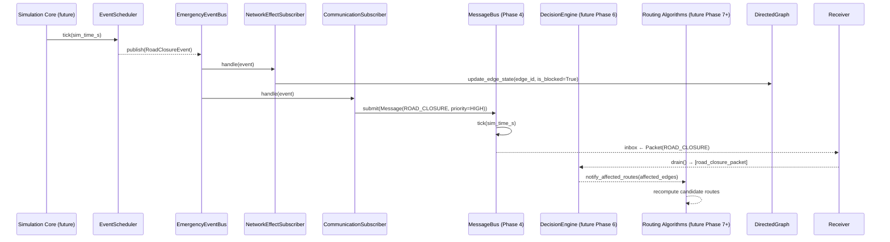

# Emergency Framework Design Document

**Document Status:** Phase 5A — awaiting approval before implementation  
**Date:** 2026-07-08  
**Approval Required Before:** Any emergency framework code is written

---

## 1. Research Motivation

### Why Decentralized Emergency Handling Is Required

Urban emergency events — road closures, accidents, emergency vehicle corridors —
create sudden, local disruptions to the road network. A centralized routing
authority that computes optimal routes for all vehicles simultaneously faces
three fundamental problems in this context:

**1. Latency.** A central server must detect the event, query the full network
state, recompute routes for every affected vehicle, and push updates. In a city
with thousands of vehicles this pipeline introduces seconds to tens of seconds
of delay. An emergency vehicle needing a corridor cleared in 30 seconds cannot
wait for a central recomputation cycle.

**2. Single point of failure.** Infrastructure failures (DD-012 in
`design_decisions.md`) can disconnect vehicles from the central authority at
precisely the moment they most need routing guidance.

**3. Scalability.** Central recomputation cost grows with the number of vehicles.
Under emergency conditions — when road capacity drops and vehicle density
increases near the incident — the server is most loaded when it can least afford
to be.

Decentralized approaches (ACO, BCO, PSO, and the proposed E³-Hybrid) overcome
these limitations: each vehicle reacts to locally observed events and propagates
information to its neighbours via V2V communication. The swarm self-organizes
a response without a central authority.

### Why This Framework Supports the Thesis Contribution

The primary thesis contribution is **E³-Hybrid decentralized swarm routing
under dynamic urban emergencies**. The quality of that contribution depends
entirely on having a rigorous, reproducible emergency framework that:

- Creates events with deterministic timing and location (reproducible experiments).
- Propagates events through the communication layer (uses Phase 4 infrastructure).
- Makes events observable by routing algorithms without coupling the two layers
  (clean architecture supports fair algorithm comparison).
- Records event lifecycles in the experiment output (supports thesis evaluation).

The emergency framework is therefore not a peripheral feature — it is the
environment in which the routing contribution is measured.

---

## 2. Emergency Taxonomy

### Supported Event Types (Phase 5)

All event types are implemented as distinct classes satisfying the
`EmergencyEvent` Protocol. New types are added without changing existing code.


#### 2.1 RoadClosure

A road segment is physically blocked and impassable.

- **Cause examples:** police cordon, flooding, structural collapse.
- **Network effect:** `Edge.state.is_blocked = True` for affected edges.
- **Cost effect:** `TravelTimeCostProvider` returns `inf` for blocked edges.
- **Duration:** finite (reopens after `duration_s`) or indefinite.
- **Propagation:** broadcast to all vehicles within radius.

#### 2.2 RoadBlock

A partial obstruction that reduces capacity or speed without fully closing the segment.

- **Cause examples:** broken-down vehicle, debris, lane restriction.
- **Network effect:** `Edge.state.congestion_factor` increased; speed reduced.
- **Cost effect:** higher travel time but edge remains traversable.
- **Duration:** finite.
- **Propagation:** broadcast to vehicles within radius.

#### 2.3 TrafficAccident

An accident that may block one or more edges and generates secondary effects
(emergency vehicle dispatch, spectator congestion).

- **Cause examples:** multi-vehicle collision, pedestrian incident.
- **Network effect:** may combine RoadClosure (blocked lanes) and RoadBlock
  (reduced speed on adjacent edges).
- **Secondary events:** may trigger an `EmergencyVehicle` event automatically.
- **Duration:** finite; severity determines clearance time.
- **Propagation:** broadcast; severity determines radius.

#### 2.4 EmergencyVehicle

An emergency vehicle (ambulance, fire truck, police) is en route and requires
a priority corridor to be cleared.

- **Cause examples:** accident response dispatch, hospital transfer.
- **Network effect:** edges on the requested corridor receive
  `emergency_penalty_s` applied to all other vehicles (discourages use).
- **Cost effect:** routing algorithms should route around the corridor.
- **Duration:** finite; ends when the vehicle reaches its destination.
- **Propagation:** high-priority broadcast (`Priority.CRITICAL`) to all
  vehicles along projected route.

#### 2.5 InfrastructureFailure

A traffic signal, bridge sensor, or road-embedded IoT device has failed.

- **Cause examples:** power outage, hardware fault, cyberattack.
- **Network effect:** affected edges lose authoritative speed/congestion data;
  vehicles must use static speed limits (fall-back to `speed_limit_mps`).
- **Cost effect:** uncertainty penalty may be applied (future extension).
- **Duration:** finite or indefinite.
- **Propagation:** broadcast to vehicles that would rely on the infrastructure.

#### 2.6 CommunicationBlackout

V2V/V2X communication is disrupted in a geographic zone.

- **Cause examples:** radio jamming, dense building obstruction, spectrum congestion.
- **Network effect:** `Edge.state.communication_penalty_s` increased for
  edges in the affected zone.
- **Bus effect:** `MessageBus` radius model may be temporarily reduced for
  vehicles in the zone (future integration).
- **Duration:** finite.
- **Propagation:** paradox — must be pre-announced before taking effect, or
  detected by vehicles from message delivery failures.

#### 2.7 HazardZone

A diffuse area hazard that does not close specific edges but increases risk.

- **Cause examples:** ice patch, chemical spill, flood water, low visibility.
- **Network effect:** `Edge.state.hazard_penalty_s` applied to edges in zone.
- **Cost effect:** additive time penalty discourages routing through the zone.
- **Duration:** finite; severity may decay over time (future).
- **Propagation:** broadcast to vehicles within radius.

### Extension Points

Future event types require only:
1. A new class satisfying `EmergencyEvent` Protocol.
2. A new `EmergencyEventType` enum member.
3. An entry in the YAML scenario schema.
4. Event bus subscribers that react to the new type.

No existing code changes are required.

---

## 3. Event Lifecycle

Every emergency event passes through a deterministic state machine:

```
CREATED
  │
  │  EventScheduler.schedule(event)
  ▼
SCHEDULED
  │
  │  sim_time >= activation_time
  ▼
ACTIVATED
  │
  │  EventBus.publish(event)
  ▼
BROADCAST ─────────────────────────────────────────────────────┐
  │                                                             │
  │  Vehicle receives MessageType.EMERGENCY_VEHICLE /          │
  │  ROAD_CLOSURE / HAZARD via MessageBus                      │
  ▼                                                             │
OBSERVED (by ≥ 1 vehicle)                                       │
  │                                                             │
  │  Vehicle.decision_engine processes event                    │
  │  (future Phase 6)                                          │
  ▼                                                             │
HANDLED (routing/behavior updated for this vehicle)             │
  │                                                             │
  │  sim_time >= activation_time + duration_s                  │
  ▼                                                             │
RESOLVED ─────────────────────────────────────────────────────►│
  │                              OR                             │
  │  sim_time >= expiration_time                                │
  ▼                                                             │
EXPIRED ◄──────────────────────────────────────────────────────┘
```

**State descriptions:**

| State | Meaning |
|---|---|
| `CREATED` | Event object constructed but not yet placed into the scheduler. |
| `SCHEDULED` | Event is in the scheduler queue; not yet active. |
| `ACTIVATED` | Simulation clock has reached `activation_time`; event is now live. |
| `BROADCAST` | Event has been published to the `EmergencyEventBus`; subscribers notified. |
| `OBSERVED` | At least one vehicle has received the communication-layer message. |
| `HANDLED` | At least one vehicle has updated its behavior in response. |
| `RESOLVED` | Event ended normally (duration elapsed); network effects reversed. |
| `EXPIRED` | Event TTL elapsed without being handled (no response possible). |

**Invariants:**
- An event can only move forward through the lifecycle; no backward transitions.
- `RESOLVED` and `EXPIRED` are terminal states.
- Network effects (blocked edges, penalties) are reversed on `RESOLVED`.
- `OBSERVED` and `HANDLED` are informational flags; they do not block resolution.


---

## 4. Event Scheduling

### 4.1 EventScheduler Design

The `EventScheduler` manages all pending and active events. It is the single
source of truth for what events exist in a simulation run.

```
EventScheduler
├── _pending_queue    : sorted list of (activation_time, EmergencyEvent)
├── _active_events    : dict[EventId, EmergencyEvent]
├── _resolved_events  : list[EmergencyEvent]  (for output log)
└── _random           : random.Random          (seeded stream)
```

The scheduler is advanced by calling `tick(sim_time_s)` once per simulation
step. It returns a list of newly activated events that the caller must publish
to the `EmergencyEventBus`.

### 4.2 Supported Scheduling Modes

#### Scheduled (deterministic)

Events with fixed `activation_time` loaded directly from the scenario YAML.
These events fire at exactly the specified simulation time.

```yaml
events:
  - id: closure_001
    type: road_closure
    activation_time: 120.0   # seconds into simulation
    duration: 300.0
    location: {edge_id: "E42"}
```

#### Random (seeded)

Events generated probabilistically from a configured distribution, using a
named `SeededRandomFactory` stream so they are reproducible.

```yaml
  - id: random_accident_pool
    type: traffic_accident
    scheduling: random
    seed_stream: emergency_accidents   # named stream from SeededRandomFactory
    rate_per_hour: 2.0                 # Poisson arrival rate
    earliest: 60.0
    latest: 3600.0
```

#### Scenario-defined

Events loaded from external scenario files. Supports referencing scenario
libraries for standard urban emergency profiles (rush-hour, night, event-day).

#### Progressive

Events that escalate over time. A `RoadBlock` may progress to a `RoadClosure`
if unhandled after a threshold duration.

```yaml
  - id: incident_007
    type: road_block
    activation_time: 200.0
    duration: 600.0
    progression:
      - at_elapsed: 300.0
        escalate_to: road_closure
```

#### Recurring

Events that repeat on a schedule (e.g., school-zone speed restrictions at
fixed times).

```yaml
  - id: school_zone_morning
    type: hazard_zone
    scheduling: recurring
    first_activation: 480.0   # 8:00 AM
    interval: 86400.0         # daily
    duration: 3600.0
```

### 4.3 Reproducibility Guarantee

All random event generation uses `SeededRandomFactory.create("emergency_<name>")`
streams. Given the same seed and scenario file, every run produces exactly the
same event sequence. This is recorded in `environment.json` under `random_seed`.

---

## 5. Scenario Format (YAML Schema)

### 5.1 Top-Level Structure

```yaml
scenario:
  name: "rush_hour_emergency"
  seed: 42
  description: "Afternoon peak with one accident and one emergency vehicle."
  simulation_duration_s: 3600.0

  network:
    source: "outputs/graphs/city_network.json"   # serialized DirectedGraph

  vehicles:
    count: 50
    config: "configs/vehicle_compact.yaml"       # VehicleFactory config

  events:
    - <EventDefinition>
    - <EventDefinition>
    ...
```

### 5.2 Event Definition Schema

Every event record must contain:

```yaml
- id: "event_001"              # string, unique within scenario
  type: road_closure           # EmergencyEventType enum value
  activation_time: 120.0       # simulation seconds; non-negative
  duration: 300.0              # seconds; positive. null = indefinite
  severity: 0.8                # [0.0, 1.0]; 1.0 = maximum
  priority: critical           # low | normal | high | critical
  location:
    edge_ids: ["E42", "E43"]   # affected edges (road_closure, road_block, accident)
    # OR
    center_node: "N17"         # for radius-based events
    radius_m: 200.0
  broadcast_radius_m: 500.0    # communication radius for initial announcement
  metadata:                    # arbitrary key-value pairs; not interpreted
    cause: "water_main_break"
    source: "infrastructure_sensor_12"
```

### 5.3 Field Validation Rules

| Field | Constraint |
|---|---|
| `id` | Non-empty string, unique within scenario |
| `type` | Must match a valid `EmergencyEventType` member |
| `activation_time` | Non-negative float |
| `duration` | Positive float or `null` (indefinite) |
| `severity` | Float in [0.0, 1.0] |
| `priority` | One of: `low`, `normal`, `high`, `critical` |
| `location` | Must contain either `edge_ids` or (`center_node` + `radius_m`) |
| `broadcast_radius_m` | Positive float |

Validation is performed by `ScenarioLoader` at load time. Any violation raises
`ScenarioError` (a subclass of `E3HybridError`) with a descriptive message.


---

## 6. Emergency Entities — Interfaces and Design

### 6.1 Design Principle: Protocol-Based, Not Inheritance-Based

Following the same philosophy as `CostProvider`, `EnergyModel`, and
`CommunicationProtocol`, emergency entities are expressed as `typing.Protocol`
interfaces. This avoids deep inheritance hierarchies and allows any class that
satisfies the structural interface to be used as an emergency event.

### 6.2 EmergencyEvent Protocol

```python
class EmergencyEvent(Protocol):
    """Interface that all emergency events must satisfy."""

    @property
    def event_id(self) -> EventId: ...

    @property
    def event_type(self) -> EmergencyEventType: ...

    @property
    def activation_time_s(self) -> float: ...

    @property
    def duration_s(self) -> float | None: ...      # None = indefinite

    @property
    def severity(self) -> float: ...               # [0.0, 1.0]

    @property
    def priority(self) -> Priority: ...            # reuses communication.Priority

    @property
    def status(self) -> EventStatus: ...

    @property
    def affected_edge_ids(self) -> frozenset[EdgeId]: ...

    @property
    def location(self) -> EventLocation: ...

    @property
    def broadcast_radius_m(self) -> float: ...

    @property
    def metadata(self) -> Mapping[str, Any]: ...

    def is_active(self, sim_time_s: float) -> bool: ...
    def is_expired(self, sim_time_s: float) -> bool: ...
    def to_dict(self) -> dict[str, Any]: ...
```

### 6.3 EmergencyEventType Enum

```python
class EmergencyEventType(StrEnum):
    ROAD_CLOSURE           = "road_closure"
    ROAD_BLOCK             = "road_block"
    TRAFFIC_ACCIDENT       = "traffic_accident"
    EMERGENCY_VEHICLE      = "emergency_vehicle"
    INFRASTRUCTURE_FAILURE = "infrastructure_failure"
    COMMUNICATION_BLACKOUT = "communication_blackout"
    HAZARD_ZONE            = "hazard_zone"
    # Future: FLOODING, CONSTRUCTION, WEATHER, FIRE_INCIDENT, ...
```

### 6.4 EventLocation

```python
@dataclass(frozen=True, slots=True)
class EventLocation:
    """Geographic location descriptor for an emergency event."""
    edge_ids: frozenset[EdgeId]       # directly affected edges
    center_node: NodeId | None        # for radius-based events
    radius_m: float | None            # broadcast/effect radius
    metadata: Mapping[str, Any]       # altitude, zone name, etc.
```

### 6.5 Concrete Event Classes

Each concrete class is a frozen dataclass satisfying `EmergencyEvent`:

| Class | Primary network effect | Key extra fields |
|---|---|---|
| `RoadClosureEvent` | Sets `is_blocked=True` on `affected_edge_ids` | `blocking_cause: str` |
| `RoadBlockEvent` | Sets `congestion_factor` on affected edges | `speed_reduction_factor: float` |
| `TrafficAccidentEvent` | Combines closure + congestion; may spawn `EmergencyVehicleEvent` | `vehicle_count: int`, `spawns_emergency_vehicle: bool` |
| `EmergencyVehicleEvent` | Sets `emergency_penalty_s` on corridor edges | `origin_node`, `destination_node`, `vehicle_type: str` |
| `InfrastructureFailureEvent` | Marks edges as data-unreliable | `failed_sensor_ids: frozenset` |
| `CommunicationBlackoutEvent` | Sets `communication_penalty_s`; reduces effective radius | `affected_zone: EventLocation` |
| `HazardZoneEvent` | Sets `hazard_penalty_s` on affected edges | `hazard_type: str`, `decay_rate: float` |

### 6.6 Why Composition Over Inheritance

A `TrafficAccident` is not "a kind of" `RoadClosure` in the OO inheritance
sense — it is an event that *may produce* closure effects. Using composition
(each event class independently specifies its network effects) avoids fragile
multi-level inheritance and makes each event independently serializable and
testable.

---

## 7. Event Propagation — The Emergency Event Bus

### 7.1 Architecture: Event Bus, Not Direct Calls

The emergency framework publishes events to an `EmergencyEventBus`. Subscribers
(communication layer, decision engine, metrics, visualization) register handlers
and are notified when events are published. The emergency framework never calls
routing algorithms directly.

```
EventScheduler
      │
      │ tick(t) → [activated events]
      ▼
EmergencyEventBus.publish(event)
      │
      ├──► CommunicationSubscriber
      │         │ creates MessageType.ROAD_CLOSURE / EMERGENCY_VEHICLE / HAZARD
      │         │ calls MessageBus.submit(message)
      │         ▼
      │      Vehicles receive via Receiver.inbox
      │
      ├──► NetworkEffectSubscriber
      │         │ reads event.affected_edge_ids
      │         │ calls DirectedGraph.update_edge_state(edge_id, new_state)
      │         ▼
      │      CostProvider sees updated MutableEdgeState
      │
      ├──► MetricsSubscriber (future Phase 13)
      │         │ records event activation time, affected edges, severity
      │         ▼
      │      Appended to emergency_log.csv
      │
      └──► DecisionEngineSubscriber (future Phase 6)
                │ notifies routing agents to reconsider
                ▼
             Routing algorithms re-evaluate affected routes
```

### 7.2 EmergencyEventBus Interface

```python
class EmergencyEventBus(Protocol):
    def subscribe(self, event_type: EmergencyEventType,
                  handler: Callable[[EmergencyEvent], None]) -> None: ...
    def subscribe_all(self, handler: Callable[[EmergencyEvent], None]) -> None: ...
    def publish(self, event: EmergencyEvent) -> None: ...
    def unsubscribe(self, event_type: EmergencyEventType,
                    handler: Callable[[EmergencyEvent], None]) -> None: ...
```

### 7.3 What the Emergency Framework Does NOT Do

- It does **not** call any routing algorithm directly.
- It does **not** know about ACO pheromones, BCO scouts, or PSO particles.
- It does **not** modify `DirectedGraph` directly — that is the `NetworkEffectSubscriber`'s job.
- It does **not** decide which vehicle should respond to an emergency vehicle event.
- It does **not** import from `vehicle.energy`, `network.cost`, or any routing module.

The emergency framework's only responsibilities are:
1. Maintain the event lifecycle state machine.
2. Fire events at the right simulation time.
3. Publish events to the event bus.

Everything else is handled by subscribers.


---

## 8. Interaction Diagram

### 8.1 Full System Interaction (Simulation Tick)



### 8.2 Layer Dependency Rules

| Layer | May import from | Must NOT import from |
|---|---|---|
| Emergency framework | `core.exceptions`, `network.types`, `communication.enums`, `communication.types` | routing, vehicle.energy, SUMO |
| Communication subscriber | `communication`, `emergency` | routing, vehicle.energy, SUMO |
| Network effect subscriber | `network`, `emergency` | routing, vehicle.energy, SUMO |
| Routing algorithms | `network`, `vehicle`, `communication.Broadcaster/Receiver` | `emergency` directly — receives via event bus |
| SUMO adapter (future) | `network`, `emergency`, `communication` | routing algorithms |

### 8.3 Event Bus vs. Direct Calls — Design Rationale

The event bus pattern is chosen over direct calls for three reasons:

1. **Decoupling.** The emergency framework does not need to know how many
   subscribers exist, what they do, or in what order they process events.
   Adding a metrics subscriber or visualization subscriber requires zero changes
   to the emergency module.

2. **Testability.** Each subscriber can be tested in isolation by publishing
   test events directly to the bus. No simulation core is required.

3. **Algorithm fairness.** If emergency events were pushed directly to routing
   algorithms, the framework would implicitly favor algorithms that receive
   richer event data. By routing everything through the communication layer
   (where loss models and latency can apply), all algorithms compete on equal
   terms with the same information quality.

---

## 9. Validation Rules

All validation is performed at load time by `ScenarioLoader` and at
construction time by event dataclasses. No silent failures.

### Hard errors (raise ScenarioError)

| Rule | Error message template |
|---|---|
| `id` is empty | `"event id must be non-empty"` |
| Duplicate `id` within scenario | `"duplicate event_id: '{id}'"` |
| `type` is not a valid `EmergencyEventType` | `"unknown event type: '{type}'"` |
| `activation_time < 0` | `"activation_time must be non-negative"` |
| `duration <= 0` (when provided) | `"duration must be positive when specified"` |
| `severity` outside [0.0, 1.0] | `"severity must be in [0.0, 1.0]"` |
| `priority` is not a valid value | `"priority must be one of: low, normal, high, critical"` |
| `location` missing both `edge_ids` and `center_node` | `"event location must specify edge_ids or center_node"` |
| `broadcast_radius_m <= 0` | `"broadcast_radius_m must be positive"` |
| `activation_time > simulation_duration_s` | `"event activation_time exceeds simulation duration"` |
| Referenced `edge_id` not in loaded graph | `"event '{id}' references unknown edge '{edge_id}'"` |
| Referenced `node_id` not in loaded graph | `"event '{id}' references unknown node '{node_id}'"` |
| Negative `radius_m` | `"radius_m must be positive"` |
| `EmergencyVehicleEvent` missing `origin_node` or `destination_node` | `"emergency vehicle event requires origin and destination"` |
| Progressive escalation target is unknown type | `"unknown escalation type: '{type}'"` |
| Recurring event `interval <= 0` | `"recurring event interval must be positive"` |

### Soft warnings (log only)

| Condition | Warning |
|---|---|
| `duration_s` is `None` (indefinite) | `"event '{id}' has no duration — will not auto-resolve"` |
| `broadcast_radius_m` is very small (< 10 m) | `"event '{id}' broadcast radius may be too small to reach any vehicle"` |
| `severity = 0.0` | `"event '{id}' has zero severity — no network effect will be applied"` |

---

## 10. Emergency Metrics (Future Phase 13)

The following metrics will be computed by the metrics subscriber and written
to `emergency_log.csv`. They are listed here to guide interface design but
are not implemented in Phase 5.

| Metric | Definition | Unit |
|---|---|---|
| `event_detection_latency_s` | Time from `ACTIVATED` to first vehicle `OBSERVED` | seconds |
| `corridor_formation_time_s` | Time from `EmergencyVehicleEvent.ACTIVATED` to corridor clear | seconds |
| `blocked_road_duration_s` | Total time an edge is in `is_blocked=True` state | seconds |
| `reroute_delay_s` | Increase in vehicle travel time caused by an event | seconds |
| `event_propagation_latency_s` | Time from `BROADCAST` to all vehicles within radius `OBSERVED` | seconds |
| `emergency_vehicle_delay_s` | Emergency vehicle travel time vs. unobstructed baseline | seconds |
| `response_rate` | Fraction of vehicles that updated behavior within TTL | dimensionless |
| `false_alarm_rate` | Fraction of events that expired without any vehicle `OBSERVED` | dimensionless |

These metrics directly support the thesis evaluation: they quantify how well
E³-Hybrid and competing algorithms respond to emergency events compared to
baseline (Dijkstra, A*) and to each other.


---

## 11. Extension Strategy

The emergency framework is designed so that every future extension adds new
classes without modifying existing ones.

### Adding New Event Types

1. Add a new `EmergencyEventType` enum member.
2. Create a frozen dataclass satisfying the `EmergencyEvent` Protocol.
3. Add a YAML schema entry.
4. Optionally add a new subscriber that handles the specific type.
5. Existing subscribers that use `subscribe_all` receive the new type automatically.

**No changes required to:** `EventScheduler`, `EmergencyEventBus`,
`NetworkEffectSubscriber`, or any routing algorithm.

### Fire Trucks and Police

```
EmergencyVehicleEvent.metadata["vehicle_type"] = "fire_truck" | "police" | "ambulance"
```

Different corridor widths or priority levels are expressed through `severity`
and `priority` fields. No new event class is needed.

### Flooding and Weather

```python
class FloodingEvent:      # new class, satisfies EmergencyEvent
    flood_depth_m: float
    drainage_rate_m_per_s: float
```

The `HazardZoneEvent` already covers static hazards. `FloodingEvent` would
extend this with dynamic depth modelling. The decision engine (future Phase 6)
would apply edge traversability constraints based on `flood_depth_m`.

### Construction Zones

`RoadBlockEvent` with `metadata["cause"] = "construction"` and
`scheduling: recurring` handles most construction scenarios. A dedicated
`ConstructionZoneEvent` would add lane configuration changes and time-of-day
restrictions — requiring only a new event class and subscriber.

### Multiple Simultaneous Incidents

The `EmergencyEventBus` already handles multiple concurrent events. The
`EventScheduler` holds them in a sorted priority queue. The only design
constraint is that `NetworkEffectSubscriber` must apply effects
**additively** (multiple hazard penalties sum; multiple closures on the
same edge do not double-close). This conflict-resolution rule must be
specified in the implementation phase.

### Battery/Charging Intersection

When a `RoadClosureEvent` affects the only route to a charging station, the
`DecisionEngine` (future Phase 6) must evaluate whether the vehicle has
sufficient range to reach an alternative charger. This interaction is handled
entirely in Phase 6 — the emergency framework publishes the event and has no
knowledge of battery state.

### Different Vehicle Classes

Different vehicle types (trucks, motorcycles, EVs) may have different
traversability constraints under the same event (a motorcycle can pass a
partial road block that a truck cannot). This is expressed through
`severity` thresholds in the vehicle's decision policy — the emergency
event simply publishes its severity and each vehicle's decision engine
applies its own threshold. No change to the emergency framework.

---

## 12. Module Structure (Planned)

```
src/e3hybrid/emergency/
├── __init__.py               Public API
├── types.py                  EventId, EventStatus enum, EventLocation
├── enums.py                  EmergencyEventType enum
├── event.py                  EmergencyEvent Protocol + base helpers
├── events/
│   ├── road_closure.py       RoadClosureEvent
│   ├── road_block.py         RoadBlockEvent
│   ├── accident.py           TrafficAccidentEvent
│   ├── emergency_vehicle.py  EmergencyVehicleEvent
│   ├── infrastructure.py     InfrastructureFailureEvent
│   ├── blackout.py           CommunicationBlackoutEvent
│   └── hazard.py             HazardZoneEvent
├── bus.py                    EmergencyEventBus
├── scheduler.py              EventScheduler
├── subscribers/
│   ├── network_effect.py     NetworkEffectSubscriber
│   └── communication.py      CommunicationSubscriber
├── scenario.py               ScenarioLoader, ScenarioError
└── validation.py             validate_scenario_dict()
```

---

## 13. Open Questions (Require Approval Before Implementation)

The following design choices are documented here but require explicit approval
before the implementation phase:

1. **NetworkEffectSubscriber additive vs. last-write semantics.**  
   When two events affect the same edge simultaneously (e.g., a RoadBlock and a
   HazardZone), should effects be additive (sum penalties) or last-write-wins
   (most recent event's effect applies)? **Recommendation: additive**, because
   it correctly models overlapping real-world conditions.

2. **Event resolution and edge state cleanup.**  
   When an event resolves, how are edge state values restored? Options:
   (a) recompute from scratch from all remaining active events; (b) track
   a delta per event and subtract on resolution.  
   **Recommendation: (a) full recompute**, to avoid floating-point drift
   accumulation over long runs.

3. **CommunicationBlackout and MessageBus coupling.**  
   Should `CommunicationBlackoutEvent` directly modify the `FixedRadiusModel`
   registered positions, or should it set an edge-level flag that the radius
   model consults? The latter keeps the communication layer unaware of
   emergency events.  
   **Recommendation: edge flag (`communication_penalty_s`) approach**, which
   is already implemented in `MutableEdgeState`.

4. **EmergencyVehicle corridor routing.**  
   Should the framework pre-compute the emergency vehicle's route and set
   penalties along that specific path, or should it broadcast a zone-based
   hazard and let all vehicles avoid it independently?  
   **Recommendation: zone-based broadcast** for Phase 5, corridor-specific
   routing in a later phase when A* is available to compute the EV path.

---

*Document complete. Awaiting approval before implementing Phase 5.*
